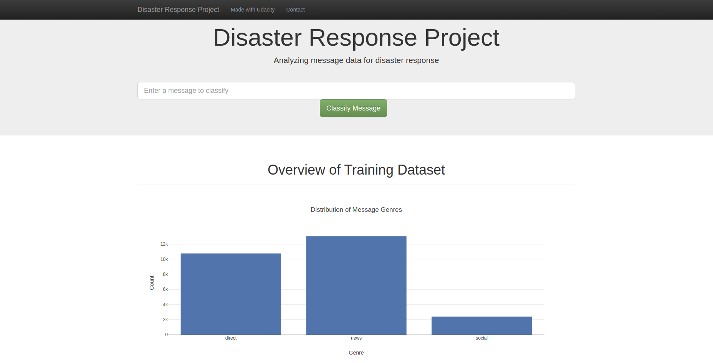
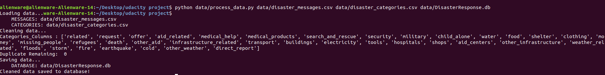
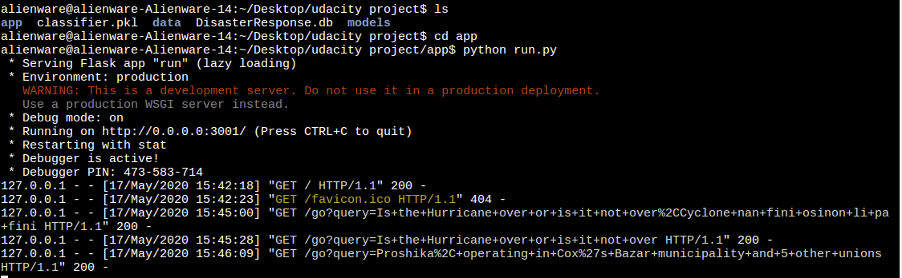
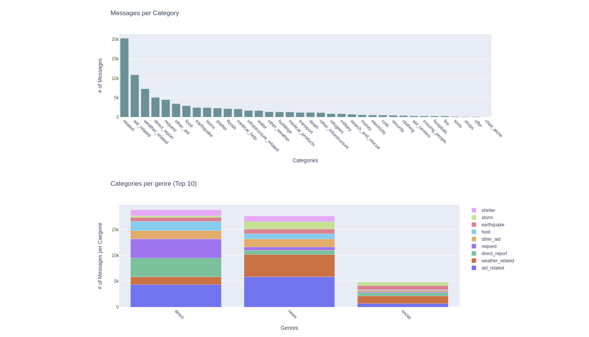
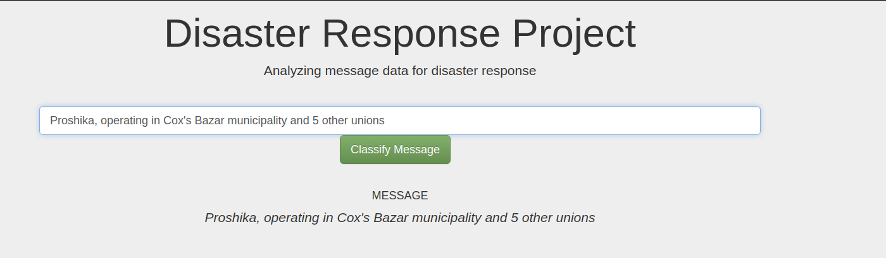
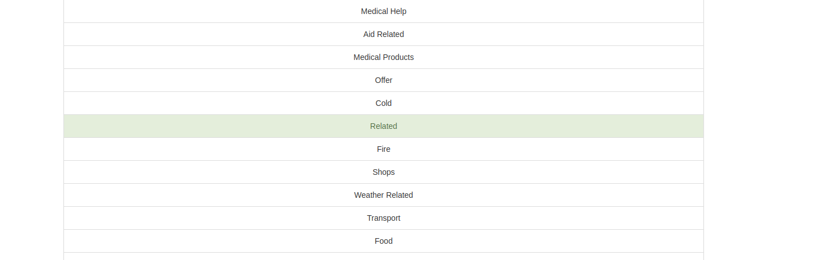

# Disaster_Respose_Pipeline
## 1 Objective
In this project, I'm applying Data Engineering  techniques to analyze the data from <a href="https://www.figure-eight.com/" target="_blank">Figure Eight</a> to build a classification model for an API that classify the Disaster message into one of the given 36 categories and contact the particular category company to help these peoples.

In **_data_, Directory** contains the dataset of real Disaster messages amd categories. You will also get the update data from <a href="https://www.figure-eight.com/" target="_blank">Figure Eight</a> website. 
I use these datasets to perform ETL operations to clean the data that can easily feed into the **Machine Learning** model and get better results. In Data Engineering, the main task is to clean the data and make a pipeline to use multiple algorithms at a time and get better accuracy. 

To make it useable for not a technical person, I'll make a user-friendly web-app and help it, users, to easily type their queries and get the response from the appropriate relief agency.

## 2 Project Components
### 2.1 ETL Pipeline
- Load the dataset ('Disaster_messages.csv and Disaster_categories.csv')
- Merge the dataset
- Perform Data wrangling techniques to clean tha data
- Store the data into **SQlite Database**

### 2.2 ML Pipeline
 - Load data from **SQlite Database**
 - Split the data into testing and training set
 - Build a pipeline of text processing (NLP) and **Machine Learning Model**
 - Train and tune the model using **GridSearchCV**
 - Predict the output on test data
 - Export the final model into **modelname.pkl** format
 
 ### 2.3 Flask Web-App
 - Load the Database and model
 - run the command python **app/run.py**
 - webpage is open in a given address **http://0.0.0.0:3001/**
 
 
 
## 3 Running 

### 3.1 Cleaning Data
**Go to the data directory** and run the following command.
```bat
python data/process_data.py data/disaster_messages.csv data/disaster_categories.csv data/DisasterResponse.db
```
- Process_data.py includes the ETL pipeline 
- Add the dataset file path 
- Make a **Sqlite Database** file



### 3.2 Training Classifier
**Go to the models directory** run the following command.

```bat
python models/train_classifier.py data/DisasterResponse.db models/classifier.pkl
```
- train_Classifier includes the ML model
- Add the database
- Make a **classifier.pkl** pickel file

### 3.3 Web-App
**Go to the app directory** run the following command.
```bat
python app/run.py 
```


Web-app open on the browser



## 4 Testing

Add the message into the search bar



## 5 Conclusion

And the result category is shown below


##  6 Files Format
<pre>
.
├── app
│   ├── run.py------------------------# FLASK FILE THAT RUNS APP
│   ├── static
│   │   └── favicon.ico---------------# FAVICON FOR THE WEB APP
│   └── templates
│       ├── go.html-------------------# CLASSIFICATION RESULT PAGE OF WEB APP
│       └── master.html---------------# MAIN PAGE OF WEB APP
├── data
│   ├── DisasterResponse.db-----------# DATABASE TO SAVE CLEANED DATA TO
│   ├── disaster_categories.csv-------# DATA TO PROCESS
│   ├── disaster_messages.csv---------# DATA TO PROCESS
│   └── process_data.py---------------# PERFORMS ETL PROCESS
├── img-------------------------------# PLOTS FOR USE IN README AND THE WEB APP
├── models
│   └── train_classifier.py-----------# PERFORMS CLASSIFICATION TASK

</pre>

## Credits and Acknowledgement

Thanks <a href="https://www.udacity.com" target="_blank">Udacity</a> for this course that helps me to sharpen my skills and able me to learn new technologies and real-world data.
